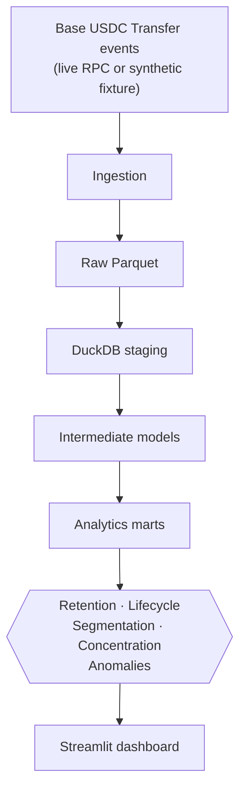
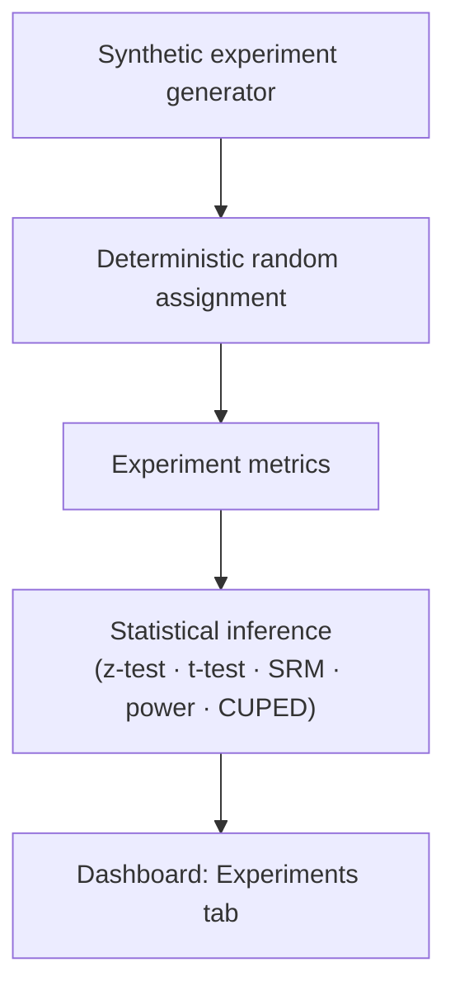
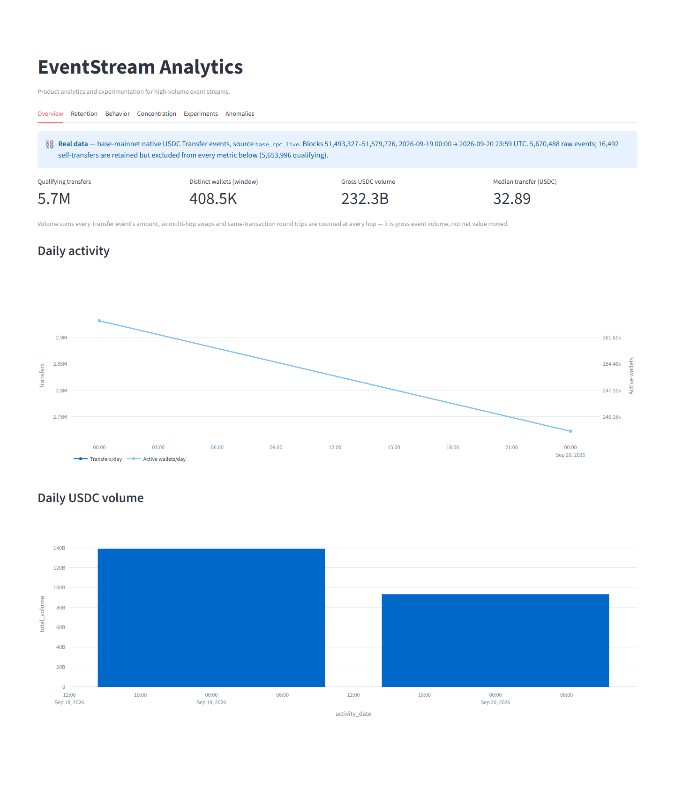
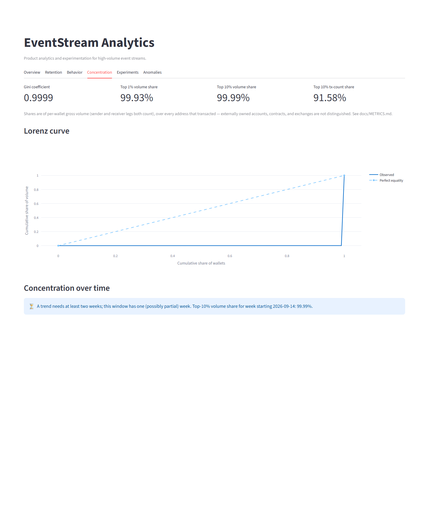
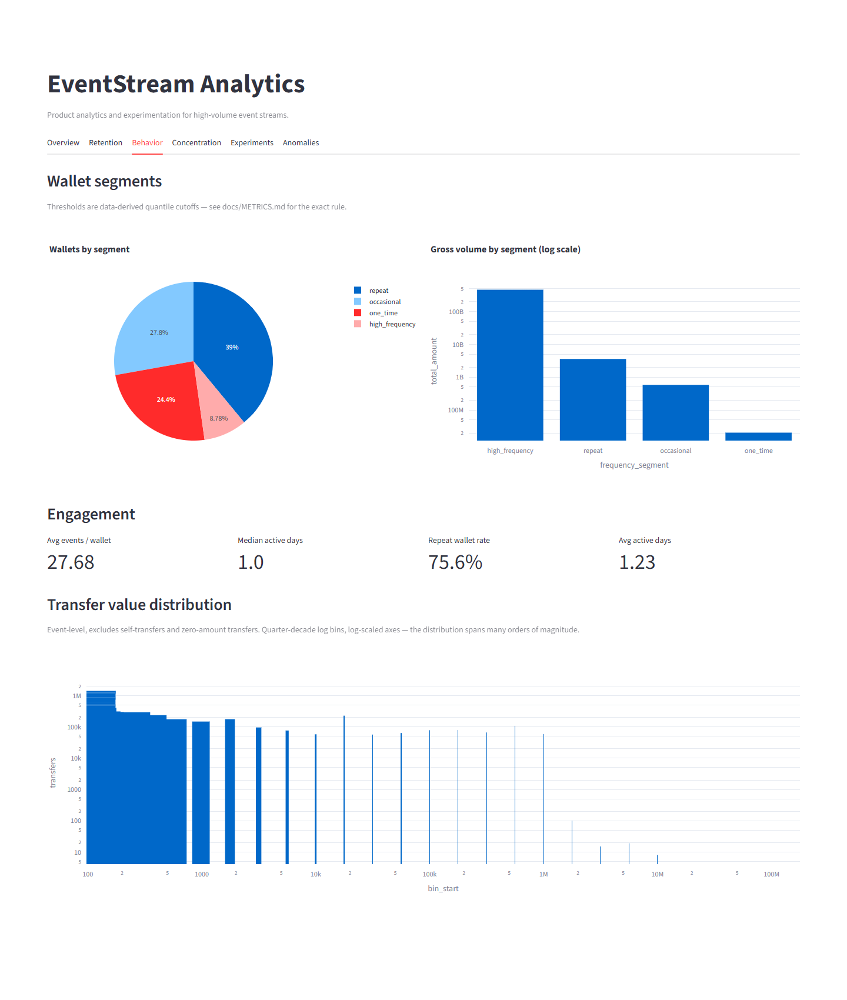
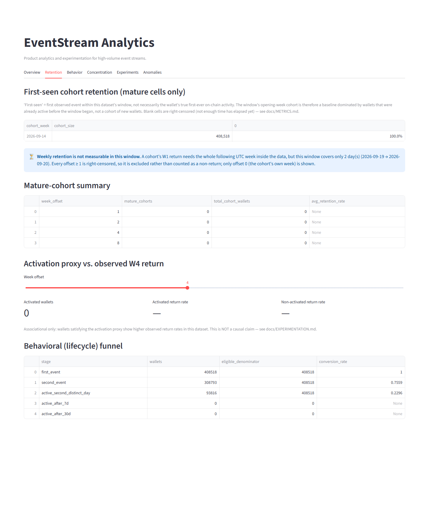

# EventStream Analytics

**Product analytics and experimentation for high-volume event streams.**
Demonstrated on a bounded window of real public stablecoin activity, plus a deterministic
synthetic fixture for what a short window cannot show.

This project treats Base-network USDC transfer events as a behavioral event
stream — wallets as pseudonymous users, transfers as events — and builds the
full stack a product/data analyst is actually judged on: a SQL warehouse,
cohort and retention analysis with right-censoring handled explicitly,
behavioral segmentation, concentration metrics, transparent anomaly
detection, and a *separate* randomized-experimentation engine that never
pretends observational blockchain data is a randomized experiment.

- Real event-data ingestion (Base mainnet, verified USDC contract), a bounded
  real-data analysis (5.67M USDC transfers, reproduced offline in one to three minutes), and a
  network-free synthetic fixture mode
- 17 SQL models across staging → intermediate → marts, using window
  functions, CTEs, and DuckDB analytical SQL throughout
- First-seen cohort retention with explicit right-censoring / maturity
  handling
- Configurable activation-proxy and lifecycle-funnel analysis (associational,
  never causal)
- Behavioral segmentation on data-derived quantile thresholds
- Concentration metrics (Gini, Lorenz curve, top-decile share)
- Transparent rolling-median / robust-MAD anomaly detection
- A separate, synthetic-data-only A/B experimentation engine: deterministic
  assignment, two-proportion z-test, Welch's t-test, chi-square SRM check,
  bootstrap CI, power/MDE calculators, and CUPED variance reduction
- A 6-tab Streamlit dashboard
- 152 tests, ruff + mypy clean, deterministic CI with zero network dependency

## What is real and what is synthetic

| Result | Data | Status |
|---|---|---|
| Event / wallet counts, daily activity, transfer-value distribution | **Real** Base USDC, 2026-09-19 → 2026-09-20 UTC | measured |
| Behavioral segments, engagement, concentration (Gini, top-N wallet share), funnel stages 1–3 | **Real** | measured (short-window, descriptive) |
| Data-quality checks and independent reconciliation | **Real** | 20 of 20 pass, 0 mismatches |
| Weekly retention W1 / W2 / W4, activation proxy vs. W2 / W4 return, funnel stages 4–5 (7 / 30 days) | **Synthetic fixture** | **not measurable** on the 2-day real window |
| Anomaly detection (needs a 7-day baseline) | **Synthetic fixture** | **not measurable** on the real window |
| A/B experimentation (z-test, t-test, SRM, power, CUPED) | **Synthetic** randomized simulator | by design: observational data is never an experiment |

Nothing synthetic is presented as a real finding, and nothing unavailable for the real window is
extrapolated or estimated. The real window is **two days (a Saturday and a Sunday) of one token on
one chain**: it does not represent all Base users, all Base activity, or even a typical weekday of
USDC. Wallets are pseudonymous addresses, and include contracts, routers and exchanges.

## Measured results

### REAL OBSERVATIONAL DATA — Base USDC, 2026-09-19 → 2026-09-20 UTC

**Real on-chain data**: Base mainnet native USDC (`0x8335…2913`), blocks
51,493,327–51,579,726, from Saturday 2026-09-19 00:00:01 UTC to Sunday
2026-09-20 23:59:59 UTC. It is a window cut from a larger 103M-event extraction that was already
downloaded, sized so the whole pipeline finishes in minutes rather than hours (see
[`docs/DECISIONS.md`](docs/DECISIONS.md), "Bounded real-data window"). Every number in this
subsection is in [`docs/real_data_findings.json`](docs/real_data_findings.json), which
`scripts/build_findings.py` writes from the warehouse; rebuilding from scratch reproduces the
file byte for byte.

- **5,670,488** Transfer events (**5,653,996** qualifying;
  16,492 self-transfers retained but excluded), **408,518**
  distinct wallets. Saturday: 2.93M transfers and
  266K active wallets; Sunday: 2.72M and
  236K.
- **Heavy right tail**: median transfer **32.89 USDC** against a mean of
  41,089; p99 ≈ 1.03M; the largest single transfer is
  219M. Gross event volume is $232.3B, but it counts
  every hop of every transaction (58.4% of events
  share a transaction with another USDC `Transfer`), so it measures token movement, not payments.
- **Dust**: 3.5% of transfers are zero-value and
  25.5% are under 1 USDC, so an "active wallet" includes passive
  counterparties: 408,518 wallets appeared on either side,
  312,111 sent at least once, and
  286,422 were party to a transfer of at least 1 USDC.
- **Extreme concentration**: Gini **0.9999**. The single largest wallet
  holds 38.6% of per-wallet gross volume, the top 10 hold 91.9% and the top 100
  99.0%. These are pooled addresses (contracts, routers and exchanges are not separated
  from externally owned accounts), so read it as volume flowing through a handful of
  infrastructure addresses, not as inequality between people.
- **Behaviour**: 75.6% of wallets took part in at least two transfers and 23.0% were active on
  both days; the busiest 8.8% of wallets (more than 10 transfers each) account for 90.6% of
  wallet-side events (a transfer counts once for each party).
- **What this window cannot show**: weekly retention (W1/W2/W4) is **not measurable** because every
  cell beyond offset 0 is right-censored, so the pipeline reports nothing rather than a made-up
  rate; anomaly detection needs a 7-day baseline; funnel stages 4 and 5 need 7 and 30 days.
  Those are demonstrated on the synthetic fixture below. A window long enough for W1 would be
  8 days at the very least (about 26M events), and about 3 weeks for a first genuinely new cohort.
  All of this describes one weekend, not general Base behaviour.
- **Verified**: 11 data-quality checks and 9 independent reconciliations (each headline mart
  recomputed straight from the raw Parquet by a different route) pass with zero mismatches.
- **Runtime**, end to end (window extraction → 17 SQL models → validate + reconcile → analyze →
  findings; one fresh process per step) on an 8-thread, 16 GB Windows laptop with DuckDB capped
  at 4 GB: **74 s, 132 s and 156 s** in three from-scratch runs (the spread is disk and cache state; the slowest was launched through `uv run`).

#### Engineering finding: nondeterministic segmentation boundaries

DuckDB's `approx_quantile` (a t-digest whose per-thread sketches merge in scheduling order) gave
**different segmentation boundaries on identical data**: the p90 events-per-wallet cutoff came out
as 9 or 10 depending on the run, re-labelling every wallet with exactly 10 events between
`repeat` and `high_frequency`, and the high-volume wallet count ranged from 40,451 to 40,728. It
surfaced when a test comparing two builds of the committed real sample disagreed on 0.02% of rows,
and was then measured on the full window. Replacing it with exact `quantile_cont` makes the
published segmentation deterministic (p90 = 10 events and 40,852 high-volume wallets on every run
and thread count); `tests/integration/test_determinism.py` pins it and fails on the old code. See
[`docs/DECISIONS.md`](docs/DECISIONS.md), "Exact quantiles".

### SYNTHETIC FIXTURE — `eventstream demo` (offline and deterministic)

Retention, the activation proxy, anomaly detection and the experimentation module need more
history than the two-day real window has, so they are demonstrated on the committed
**deterministic synthetic fixture** (`source = "synthetic_fixture"`, seed = 42). These figures
are labelled synthetic wherever they appear and are what `eventstream demo` prints today.

- **40,634** synthetic transfer events; **39,070** qualifying (non-self-transfer) events across
  a 45-day window; **1,382** distinct wallets
- Mature-cohort **W1 observed return: 91.6%**, **W2: 90.7%**, **W4: 88.7%** (right-censored
  cells correctly excluded; see [`docs/METRICS.md`](docs/METRICS.md))
- Wallets meeting the activation proxy (≥2 distinct active days in their first 7 days) show a
  **2.3× higher observed W4 return rate** (90.1% of 446 activated wallets vs. 38.5% of only 13
  non-activated ones, so a small comparison group) — *associational, not causal*
- **Top 10% of wallets account for 70.7% of observed transfer volume**; Gini coefficient **0.81**
- **5 anomalous days** flagged across 4 monitored metrics over the window, via
  rolling-median/MAD robust z-score
- Synthetic experiment (`positive_effect` scenario, n=20,000): **+2.5 percentage points**
  binary lift (p ≈ 1.1×10⁻⁸), **no** sample-ratio mismatch
- Full `eventstream demo` (fixture generation → DuckDB build across 17 SQL models → validation →
  analytics → experimentation) runs in **about 10–32 seconds** on the same machine (two runs; the spread is cache state)

## Architecture





See [`docs/ARCHITECTURE.md`](docs/ARCHITECTURE.md) for the module map and
data-flow guarantees.

## Dashboard

| Overview | Retention |
|---|---|
|  |  |

| Concentration | Experiments |
|---|---|
|  |  |

(Behavior and Anomalies tabs are in `docs/assets/` too.) These screenshots are from a real
run of this repository's own dashboard against the committed **synthetic fixture**.

**Real data (the two-day window above)**, from `scripts/capture_dashboard.py`; the Retention and
Anomalies tabs say why nothing can be scored instead of showing an empty or invented chart:

| Overview | Concentration |
|---|---|
|  |  |

| Behavior | Retention (not measurable) |
|---|---|
|  |  |

(`docs/assets/real/anomalies.png` too.)

## Quick start

```bash
uv sync --all-extras

# Full pipeline in one shot: fixture -> warehouse -> validate -> analyze -> experiment
uv run eventstream demo

# Or step by step:
uv run eventstream ingest --mode fixture
uv run eventstream transform
uv run eventstream validate
uv run eventstream analyze
uv run eventstream experiment --scenario positive_effect

# Dashboard
uv run eventstream dashboard
```

`make demo`, `make test`, `make lint`, `make typecheck`, `make dashboard`,
`make real-analysis` are also available (see `Makefile`).

## Real data ingestion

The live ingestion path targets **Base mainnet** (chain ID `8453`), the
verified native USDC contract
(`0x833589fCD6eDb6E08f4c7C32D4f71b54bdA02913`, 6 decimals), and the standard
ERC-20 `Transfer` event — see [`docs/DATA_SOURCE.md`](docs/DATA_SOURCE.md)
for the full verification and sourcing notes. It performs **read-only**
`eth_getLogs`/`eth_getBlockByNumber` calls: no private key, wallet signature,
or broadcast transaction is ever involved.

```bash
# Download a block range (about 1.3 minutes per 2,000-block segment at the public endpoint;
# Base has ~2 s blocks, so 43,200 blocks per UTC day). The window analysed in this README:
uv run eventstream ingest --mode live --start-block 51493327 --end-block 51579726 --workers 6
```

Live ingestion was run for this project: 103M events (28 days) were downloaded, then the pull
was stopped as out of scope (see [`docs/DATA_SOURCE.md`](docs/DATA_SOURCE.md)). Everything after
the download is offline. To reproduce the real-data numbers above from segments in `data/raw/`:

```bash
uv run python scripts/run_real_analysis.py     # extract-window -> transform -> validate + reconcile -> analyze -> findings
```

or step by step:

```bash
uv run eventstream extract-window --start-block 51493327 --end-block 51579726
EVENTSTREAM_WAREHOUSE_PATH=data/processed/base_usdc_real.duckdb \
  uv run eventstream transform --source-glob data/processed/window_51493327_51579726.parquet --no-global-dedup
EVENTSTREAM_WAREHOUSE_PATH=data/processed/base_usdc_real.duckdb \
  uv run eventstream validate --reconcile-glob data/processed/window_51493327_51579726.parquet
EVENTSTREAM_WAREHOUSE_PATH=data/processed/base_usdc_real.duckdb uv run eventstream analyze
```

`extract-window` refuses a range that is not covered by intact, contiguous segments, and
`--no-global-dedup` is only for such a window: the build asserts `(transaction_hash, log_index)`
uniqueness instead of paying for a whole-table dedup (see `docs/DECISIONS.md`).

## Analytics methodology

Full metric definitions (exact formulas, units, grain, assumptions, and
caveats) are in [`docs/METRICS.md`](docs/METRICS.md). Data model, schema, and
the "first-seen ≠ acquisition" / "observed return ≠ retention" terminology
are in [`docs/DATA_MODEL.md`](docs/DATA_MODEL.md). Engineering rationale
(why DuckDB, why quantile thresholds, why this anomaly method, etc.) is in
[`docs/DECISIONS.md`](docs/DECISIONS.md).

## Experimentation module

A statistically-correct A/B testing engine, demonstrated on a deterministic
synthetic generator because historical on-chain activity is observational
data, never a randomized experiment — see
[`docs/EXPERIMENTATION.md`](docs/EXPERIMENTATION.md) for the full
methodology, a worked example, and why this separation matters.

## Tests

152 tests across unit, integration, and data-quality suites — deterministic
seeds throughout, no flaky statistical assertions. They include the window extractor's
refusal cases, a check that results do not depend on DuckDB's thread count, and the pipeline
run on a committed slice of real Base events. `make test` / `uv run pytest`.

## Limitations

- A wallet is a pseudonymous address, never a claimed human identity; no
  entity resolution, Sybil detection, or demographic inference is attempted
  anywhere in this project.
- "First-seen" is bounded by the ingestion window, not the wallet's true
  first-ever on-chain activity.
- The real-data findings describe one weekend (Sat–Sun, 2026-09-19/20) of Base USDC activity.
  They do not represent all Base users or all Base activity, and the window is too short for weekly retention, anomaly scoring or
  the later funnel stages (they report "not measurable"; the synthetic fixture demonstrates
  them). Concentration and segmentation figures on the synthetic fixture reflect its synthetic,
  heavy-tailed distribution, not Base.
- Volume is gross Transfer-event volume (every hop counted) over pooled addresses, and "active"
  includes passive receivers of dust; neither is spending or a claim about people.
- `top1pct`/`top10pct` shares use `NTILE(100)` percentile bucketing, an
  approximation under ties (documented in `docs/METRICS.md`).

## Repository structure

```
src/eventstream/    # ingestion, warehouse, analytics, experimentation, validation, CLI
sql/                # staging / intermediate / marts SQL models
dashboard/          # Streamlit app
scripts/            # run_real_analysis.py (timed), build_findings.py, capture_dashboard.py
data/fixtures/      # committed deterministic synthetic fixture
data/samples/       # committed 200-block slice of real Base events (tests) + provenance
tests/              # unit / integration / data_quality
docs/               # architecture, metrics, data model, data source, experimentation, decisions,
                    # real_data_findings.json (every published real-data number)
```

## License

MIT — see [LICENSE](LICENSE).
