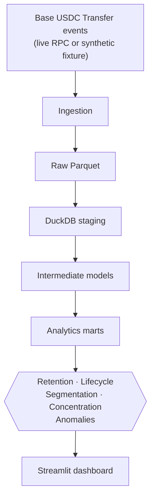
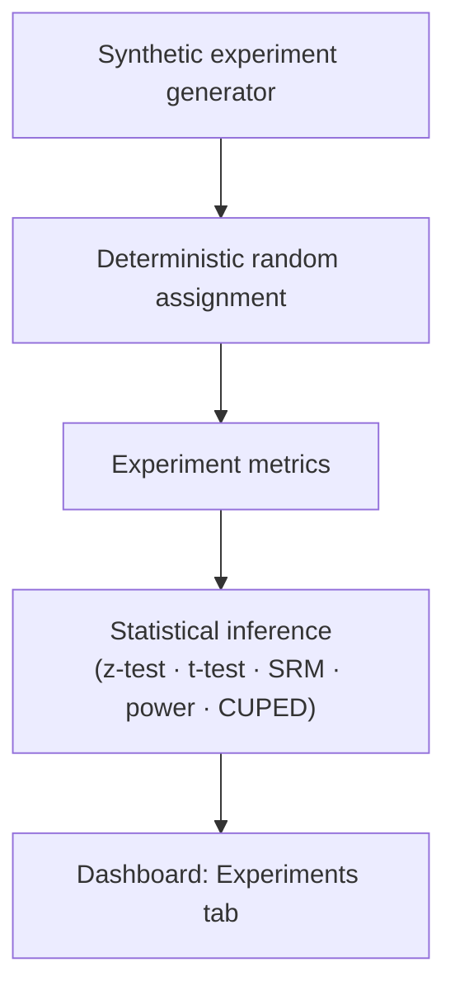
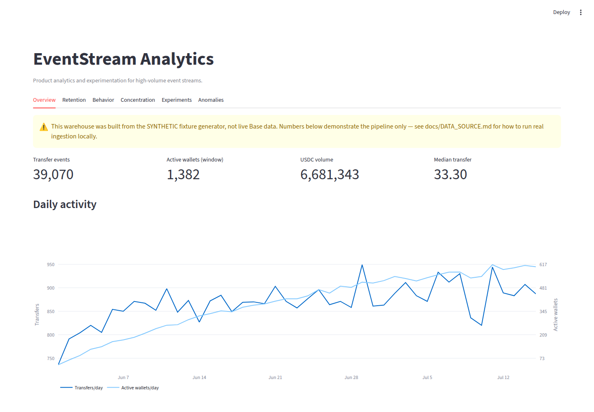
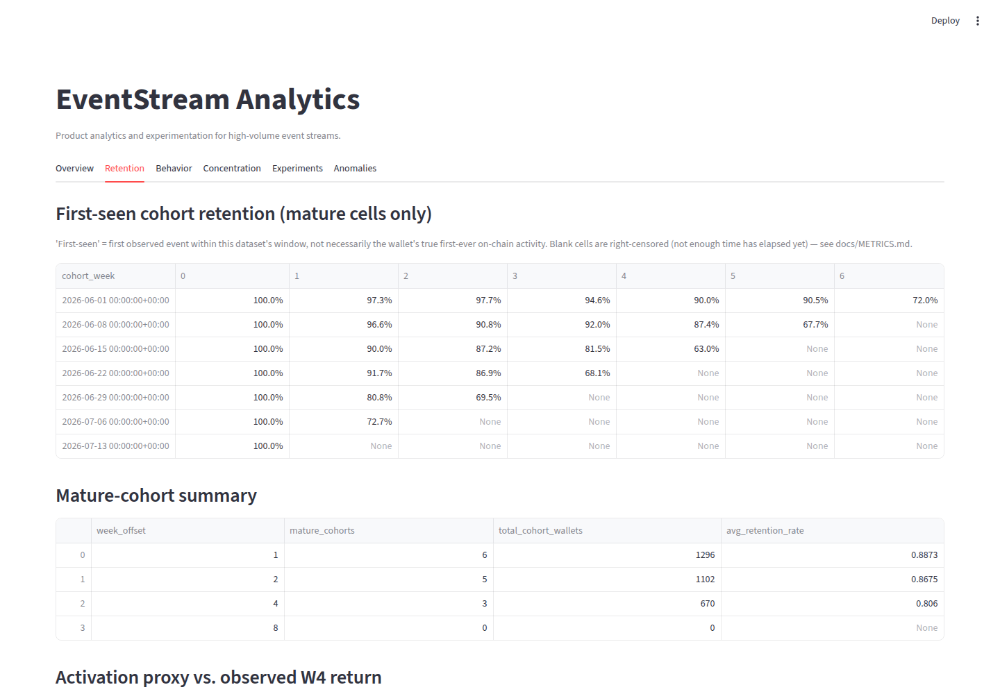
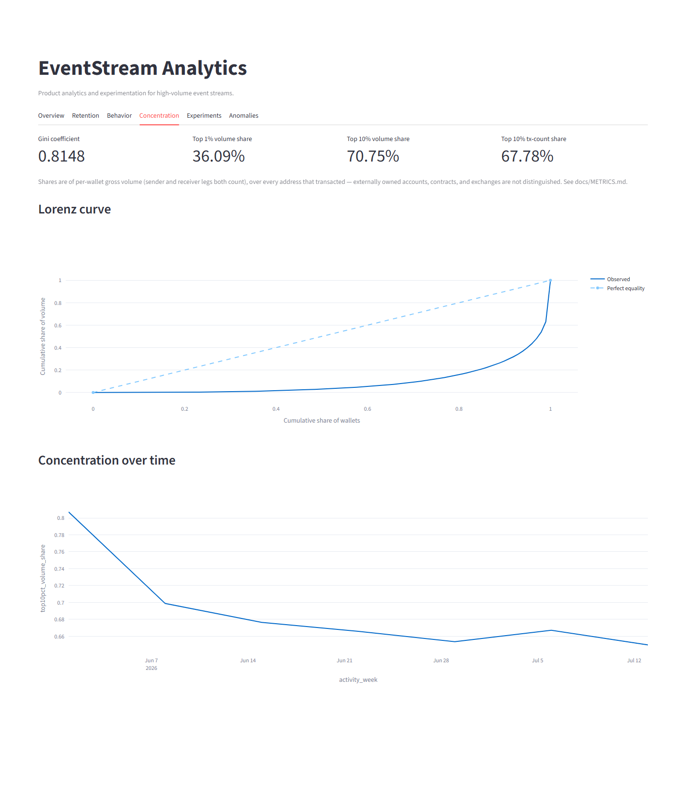
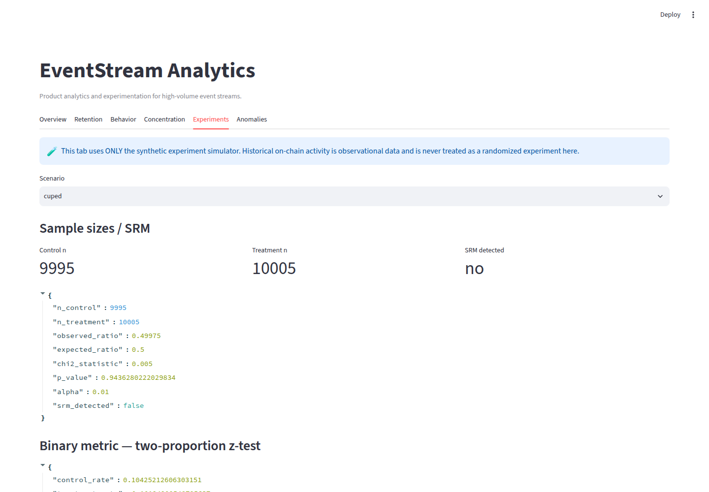

# EventStream Analytics

**Product analytics and experimentation for high-volume event streams.**
Demonstrated on real public stablecoin activity.

This project treats Base-network USDC transfer events as a behavioral event
stream — wallets as pseudonymous users, transfers as events — and builds the
full stack a product/data analyst is actually judged on: a SQL warehouse,
cohort and retention analysis with right-censoring handled explicitly,
behavioral segmentation, concentration metrics, transparent anomaly
detection, and a *separate* randomized-experimentation engine that never
pretends observational blockchain data is a randomized experiment.

- Real event-data ingestion (Base mainnet, verified USDC contract) + a
  network-free synthetic fixture mode
- 17 SQL models across staging → intermediate → marts, using window
  functions, CTEs, and DuckDB analytical SQL throughout
- First-seen cohort retention with explicit right-censoring / maturity
  handling
- Configurable activation-proxy and lifecycle-funnel analysis (associational,
  never causal)
- Behavioral segmentation on data-derived quantile thresholds
- Concentration metrics (Gini, Lorenz curve, top-decile share)
- Transparent rolling-median / robust-MAD anomaly detection
- A separate, synthetic-data-only A/B experimentation engine: deterministic
  assignment, two-proportion z-test, Welch's t-test, chi-square SRM check,
  bootstrap CI, power/MDE calculators, and CUPED variance reduction
- A 6-tab Streamlit dashboard
- 76 tests, ruff + mypy clean, deterministic CI with zero network dependency

## Measured results (synthetic fixture)

> ⚠️ **This environment's outbound network access does not reach Base's RPC
> endpoints** (confirmed via a direct connectivity test — see
> [`docs/DATA_SOURCE.md`](docs/DATA_SOURCE.md)), so the numbers below were
> produced by `eventstream demo` against the committed **deterministic
> synthetic fixture** (`source = "synthetic_fixture"`, seed = 42), not real
> Base data. Live ingestion is fully implemented and tested against a mocked
> RPC client — see [Real data ingestion](#real-data-ingestion) for the exact
> command to run it yourself once you have normal internet access. Every
> number below is what this repository's own code actually produced; none
> are hand-typed.

- **40,634** synthetic transfer events ingested; **39,070** qualifying
  (non-self-transfer) events across a 45-day window
- **1,382** distinct wallets observed
- Mature-cohort **W1 observed return: 88.7%**, **W2: 86.8%**, **W4: 80.6%**
  (right-censored cells correctly excluded — see
  [`docs/METRICS.md`](docs/METRICS.md))
- Wallets meeting the activation proxy (≥2 distinct active days in their
  first 7 days) show a **2.3× higher observed W4 return rate** (86.8% vs.
  37.6%) — *associational, not causal*
- **Top 10% of wallets account for 70.7% of observed transfer volume**;
  Gini coefficient **0.81**
- **5 anomalous days** flagged across 4 monitored metrics over the window,
  via rolling-median/MAD robust z-score
- Synthetic experiment (`positive_effect` scenario, n=20,000): **+2.5
  percentage points** binary lift (p ≈ 1.1×10⁻⁸), **no** sample-ratio
  mismatch
- Full `eventstream demo` (fixture generation → DuckDB build across 17 SQL
  models → validation → analytics → experimentation) runs in **~30 seconds**
  on the development machine

## Architecture





See [`docs/ARCHITECTURE.md`](docs/ARCHITECTURE.md) for the module map and
data-flow guarantees.

## Dashboard

| Overview | Retention |
|---|---|
|  |  |

| Concentration | Experiments |
|---|---|
|  |  |

(Behavior and Anomalies tabs are in `docs/assets/` too.) All screenshots are
from a real run of this repository's own dashboard against the committed
synthetic fixture.

## Quick start

```bash
uv sync --all-extras

# Full pipeline in one shot: fixture -> warehouse -> validate -> analyze -> experiment
uv run eventstream demo

# Or step by step:
uv run eventstream ingest --mode fixture
uv run eventstream transform
uv run eventstream validate
uv run eventstream analyze
uv run eventstream experiment --scenario positive_effect

# Dashboard
uv run eventstream dashboard
```

`make demo`, `make test`, `make lint`, `make typecheck`, `make dashboard` are
also available (see `Makefile`).

## Real data ingestion

The live ingestion path targets **Base mainnet** (chain ID `8453`), the
verified native USDC contract
(`0x833589fCD6eDb6E08f4c7C32D4f71b54bdA02913`, 6 decimals), and the standard
ERC-20 `Transfer` event — see [`docs/DATA_SOURCE.md`](docs/DATA_SOURCE.md)
for the full verification and sourcing notes. It performs **read-only**
`eth_getLogs`/`eth_getBlockByNumber` calls: no private key, wallet signature,
or broadcast transaction is ever involved.

```bash
# 1. Find a recent block number (e.g. via basescan.org or eth_blockNumber)
# 2. Pick a start/end block ~7-30 days apart (Base has ~2s blocks)
uv run eventstream ingest --mode live --start-block <START> --end-block <END>
uv run eventstream transform --source-glob "data/raw/*.parquet"
uv run eventstream validate
uv run eventstream analyze
```

This was not run against the live endpoint from the sandboxed environment
this project was built in (outbound access to `mainnet.base.org` is denied by
that environment's network policy) — run it yourself locally to get real
findings; the pipeline downstream of ingestion is identical either way.

## Analytics methodology

Full metric definitions (exact formulas, units, grain, assumptions, and
caveats) are in [`docs/METRICS.md`](docs/METRICS.md). Data model, schema, and
the "first-seen ≠ acquisition" / "observed return ≠ retention" terminology
are in [`docs/DATA_MODEL.md`](docs/DATA_MODEL.md). Engineering rationale
(why DuckDB, why quantile thresholds, why this anomaly method, etc.) is in
[`docs/DECISIONS.md`](docs/DECISIONS.md).

## Experimentation module

A statistically-correct A/B testing engine, demonstrated on a deterministic
synthetic generator because historical on-chain activity is observational
data, never a randomized experiment — see
[`docs/EXPERIMENTATION.md`](docs/EXPERIMENTATION.md) for the full
methodology, a worked example, and why this separation matters.

## Tests

76 tests across unit, integration, and data-quality suites — deterministic
seeds throughout, no flaky statistical assertions. `make test` / `uv run
pytest`.

## Limitations

- A wallet is a pseudonymous address, never a claimed human identity; no
  entity resolution, Sybil detection, or demographic inference is attempted
  anywhere in this project.
- "First-seen" is bounded by the ingestion window, not the wallet's true
  first-ever on-chain activity.
- Concentration and segmentation figures reflect the fixture's synthetic,
  heavy-tailed activity distribution — re-run against real data
  (`docs/DATA_SOURCE.md`) for real-world figures.
- `top1pct`/`top10pct` shares use `NTILE(100)` percentile bucketing, an
  approximation under ties (documented in `docs/METRICS.md`).

## Repository structure

```
src/eventstream/    # ingestion, warehouse, analytics, experimentation, validation, CLI
sql/                # staging / intermediate / marts SQL models
dashboard/          # Streamlit app
data/fixtures/      # committed deterministic synthetic fixture
tests/              # unit / integration / data_quality
docs/               # architecture, metrics, data model, experimentation, decisions
```

## License

MIT — see [LICENSE](LICENSE).
