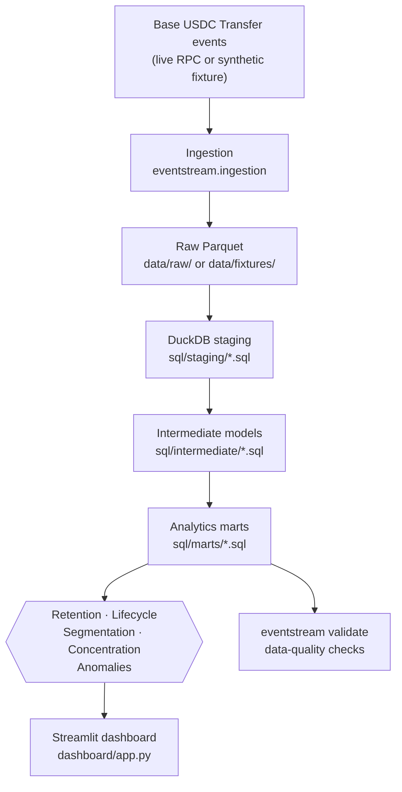
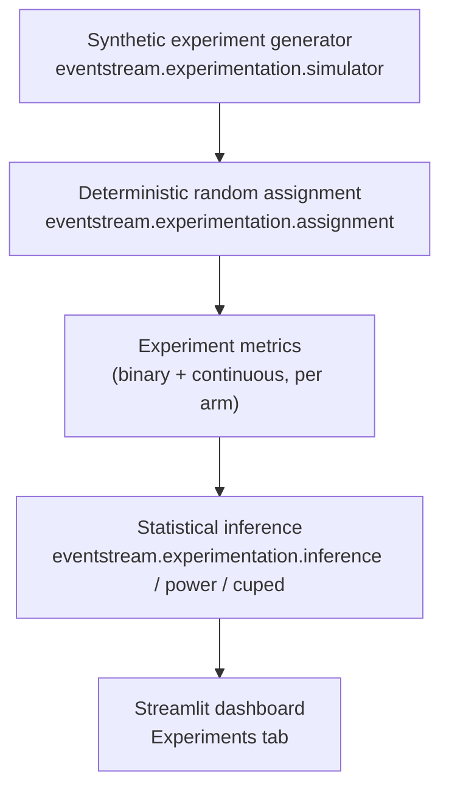

# Architecture

Two pipelines are kept deliberately separate: the **observational** analytics
pipeline (real or fixture on-chain data → SQL models → product metrics), and
the **experimentation** pipeline (synthetic randomized data → statistical
inference). They never share data, and the dashboard visually separates them
into different tabs. See `docs/EXPERIMENTATION.md` for why.

## Observational analytics pipeline



## Experimentation pipeline (synthetic only)



## Module map

```
src/eventstream/
├── cli.py              # `eventstream <command>` entrypoints
├── config.py           # verified network/contract constants + settings
├── ingestion/           # Base RPC client, USDC decoding, normalization, fixtures
├── warehouse/            # DuckDB connection + SQL-model orchestration
├── analytics/            # retention, lifecycle, segmentation, concentration, anomalies
├── experimentation/      # assignment, simulator, inference, power, CUPED
└── validation/           # data-quality checks
```

SQL lives in `sql/{staging,intermediate,marts}` as plain, individually
readable `.sql` files (see `docs/DATA_MODEL.md` and `docs/METRICS.md`) — none
of it is hidden inside Python string templates.

## Data flow guarantees

- **Deterministic**: the fixture generator, the experiment simulator, and the
  hash-based assignment are all seeded/deterministic — the same inputs always
  produce the same outputs, so CI never has a flaky statistical test.
- **No network dependency for CI/demo**: `eventstream demo` and the full test
  suite run entirely against the synthetic fixture; live Base ingestion is a
  separate, explicit opt-in (`eventstream ingest --mode live`).
- **Source-tagged**: every event row carries a `source` field
  (`"base_rpc_live"` vs. `"synthetic_fixture"`), and the dashboard surfaces a
  visible warning banner whenever the loaded warehouse is fixture-only — real
  and synthetic data are never presented ambiguously.
