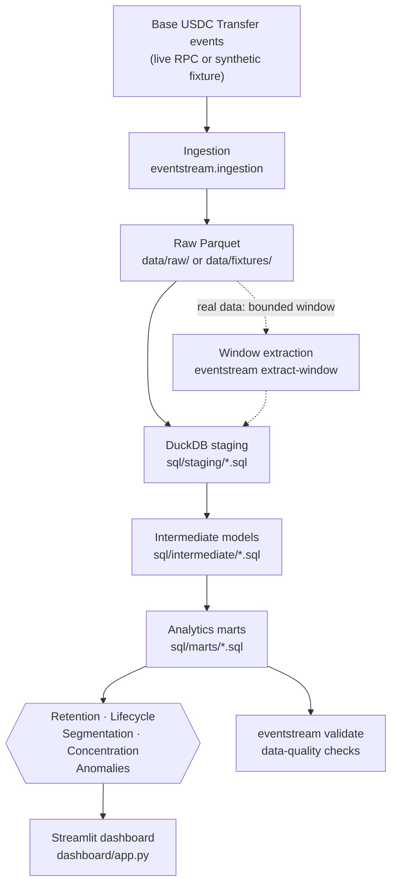
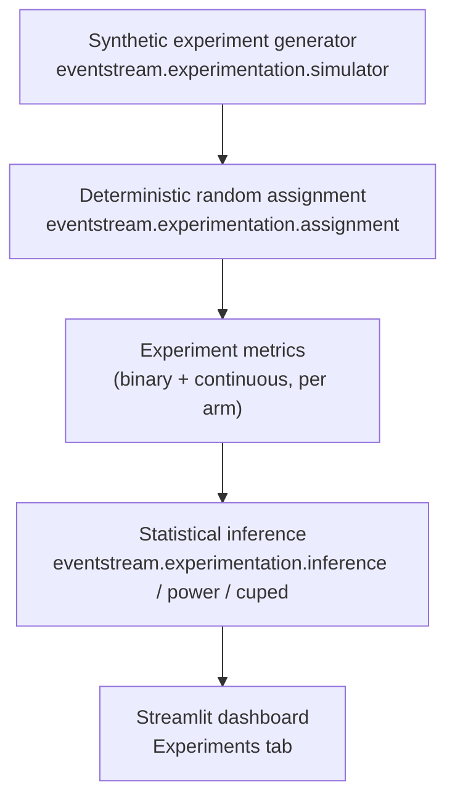

# Architecture

Two pipelines are kept deliberately separate:

- the **observational** analytics pipeline — **real Base mainnet data** (or, for the
  deterministic demo and tests, the synthetic fixture) → SQL models → product metrics.
  Observational data can support description and association, never causation;
- the **experimentation** pipeline — **synthetic, randomized, controlled data** →
  statistical inference. Randomization is what licenses a causal claim, and history cannot
  be re-randomized, so this engine is demonstrated only on simulated experiments.

They never share data, and the dashboard visually separates them into different tabs. See
`docs/EXPERIMENTATION.md` for why.

## Observational analytics pipeline



## Experimentation pipeline (synthetic only)



## Module map

```
src/eventstream/
├── cli.py              # `eventstream <command>` entrypoints
├── config.py           # verified network/contract constants + settings
├── ingestion/           # Base RPC client, checkpointed live ingestion, block-window extraction, USDC decoding, normalization, fixtures
├── warehouse/            # DuckDB connection + SQL-model orchestration
├── analytics/            # overview (provenance), retention, lifecycle, segmentation, concentration, anomalies
├── experimentation/      # assignment, simulator, inference, power, CUPED
└── validation/           # data-quality checks + independent reconciliation against the raw Parquet
```

```
scripts/                 # run_real_analysis.py (timed end-to-end run), build_findings.py, capture_dashboard.py
docs/real_data_findings.json   # every published real-data number, written from the warehouse
```

SQL lives in `sql/{staging,intermediate,marts}` as plain, individually
readable `.sql` files (see `docs/DATA_MODEL.md` and `docs/METRICS.md`) — none
of it is hidden inside Python string templates.

## Data flow guarantees

- **Deterministic**: the fixture generator, the experiment simulator, and the
  hash-based assignment are all seeded/deterministic — the same inputs always
  produce the same outputs, so CI never has a flaky statistical test.
- **No network dependency for CI/demo**: `eventstream demo` and the full test
  suite run entirely against the synthetic fixture (plus a small committed sample of real
  Base events, `data/samples/`); live Base ingestion is a separate, explicit opt-in
  (`eventstream ingest --mode live`) and its RPC client is tested against a fake endpoint.
- **Resumable, verifiable ingestion**: live ingestion writes checkpointed segments plus a
  manifest; a run either yields a dataset whose segments tile the requested range exactly, or
  fails listing what is missing.
- **Bounded, proven-disjoint real-data windows**: `eventstream extract-window` cuts an exact
  block range from live segments only after proving they tile it (no gap, no overlap, every file
  present with its recorded row count). `transform --no-global-dedup` then skips the
  whole-table `ROW_NUMBER()` dedup, and the build asserts `(transaction_hash, log_index)`
  uniqueness before anything depends on it, so the shortcut is verified rather than trusted.
- **Reproducible numbers**: quantile cutoffs are exact (`QUANTILE_CONT`), not a thread-order
  dependent t-digest, and published figures are rounded to ten significant digits. Two
  independent from-scratch rebuilds of the real window produced a byte-identical
  `real_data_findings.json`.
- **Censoring, not guessing**: a window too short for a weekly retention cell or a 7-day anomaly
  baseline reports "not measurable" (and the dashboard says so) instead of a made-up number.
- **UTC everywhere**: the warehouse connection pins the session time zone to UTC, so day/week
  boundaries do not depend on the machine.
- **Source-tagged**: every event row carries a `source` field
  (`"base_rpc_live"` vs. `"synthetic_fixture"`), and the dashboard surfaces a
  visible warning banner whenever the loaded warehouse is fixture-only — real
  and synthetic data are never presented ambiguously.
